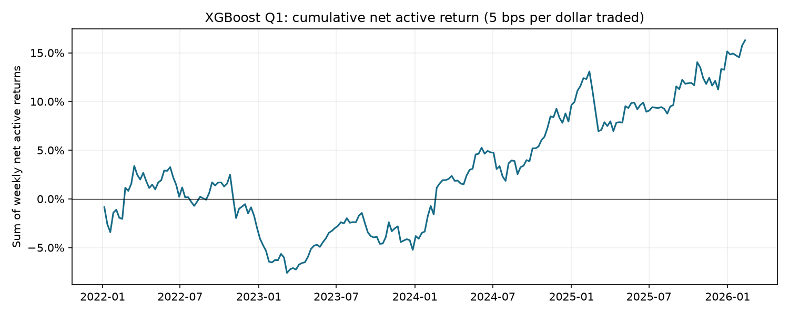
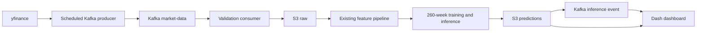

# ProjectAlpha

**Work in progress — weekly stock ranking research, moving toward automated inference.**

ProjectAlpha turns daily equity prices into weekly stock rankings. It builds twelve features, removes sector effects, trains on the most recent **260 weeks**, and ranks the current stock universe into five quintiles. **Q1 is the highest-ranked 20%** of stocks.

The current best research result uses **XGBoost regression with conservative weekly configuration selection**. The completed pipeline covers historical feature processing, S3/Athena panel access, rolling training, saved-model inference, and continuous portfolio evaluation. Kafka producer/consumer prototypes are retained for the next stage. Automated recent-data ingestion, production inference events, SHAP analysis, and the Dash dashboard are still planned.

## Current architecture

```mermaid
flowchart LR
    A[Historical daily prices] --> B[NYSE calendar and weekly snapshots]
    B --> C[12 price-based features]
    C --> D[S3 weekly feature Parquet]
    D --> E[Sector-neutral cross-sectional panel]
    E --> F[S3 / Glue / Athena]
    F --> G[Rolling 260-week XGBoost training]
    G --> H[Saved weekly model]
    H --> I[Current-week scores and Q1–Q5 ranks]
    I --> J[Forward-return evaluation and reports]
```



1. **Weekly snapshots:** Wednesday anchors use the last NYSE trading session on or before Wednesday. Missing stock quotes remain missing; they are not treated as market holidays.
2. **Features:** compute adjusted-close returns, momentum, volatility, trend, and mean-reversion indicators using the historical feature code.
3. **Normalization:** orient features, winsorize within each week and sector at 1%/99%, percentile-rank within sectors, then z-score across the weekly universe. The target starts from stock return minus its sector's mean return and receives the same cross-sectional transformation.
4. **Training:** at week `t`, fit lagged `*_train` features against `active_return_train` using exactly 260 observed outcome weeks ending at `t`. Chronological validation includes a one-week gap. Future return columns do not enter fitting or selection.
5. **Inference:** load the dated model and score current-week features to predict the next week. Rank scores and assign Q1–Q5; the evaluated portfolio holds exact Q1 with equal weights.
6. **Evaluation:** compare against `active_return_fwd` for ranking diagnostics and raw realized stock/sector-active returns for portfolio performance. Apply transaction costs to weekly weight changes.

The twelve features are `return_1w`, `return_4w`, `return_13w`, `return_26w`, `momentum_12_1`, `volatility_20d`, `volatility_60d`, `price_to_sma20`, `price_to_sma60`, `bollinger_z20`, `rsi14_simple`, and `close_to_high252`.

## Best model configuration

| Setting | Value |
|---|---|
| Estimator / objective | `XGBRegressor` / `reg:squarederror` |
| Training window | 260 weekly outcome snapshots |
| Trees / learning rate | 50 / 0.025 |
| Maximum depth / minimum child weight | 3 / 10 |
| Row / column sampling | 0.8 / 0.8 |
| L2 regularization | Original XGBoost default, 1 |
| Tree method / device | `hist` / CPU |
| Seed / ensemble | 42 / single model |
| Portfolio | Equal-weight top 20%; weekly rebalance |
| Transaction cost | 5 bps per dollar traded |

The reported best result uses this configuration as a protected starting point on every date. Three candidates each change **one** parameter: depth to 2, minimum child weight to 20, or L2 to 2. A challenger replaces it only when four chronological validation folds show all of the following:

- Net active IR improves by at least 0.10 and annualized net active return improves by at least 0.5 percentage points.
- IR improves in at least three folds, with no fold losing more than 0.25 IR.
- A four-week block bootstrap has a positive 10th-percentile paired return improvement.

The primary selection metric is **Q1 net active IR at 5 bps**. The base configuration was retained on **202 of 216** scoring dates; challengers were selected on 14. This is a dated selection strategy, so fitting only the base parameters does not reproduce the entire reported result. See the [configuration](configs/best_xgboost.json) and [exact dated choices](reports/best_model/weekly_configurations.csv).

## Obtained results

The backtest contains **215 realized weekly periods**, with signals from **5 January 2022 to 11 February 2026** and outcomes through **18 February 2026**. The final 18 February snapshot is available for inference but has no realized next-week outcome in this dataset.

| Q1 long-only metric | Result |
|---|---:|
| Annualized gross stock return | **18.20%** |
| Annualized net stock return | **15.52%** |
| Annualized gross active return | **6.63%** |
| Annualized net active return | **3.94%** |
| Net active Information Ratio | **0.632** |
| Net stock CAGR | **14.66%** |
| Maximum net stock drawdown | **−19.25%** |
| Average Q1 capture | **24.49%** |
| Average weekly turnover | **51.65%** |
| Annualized transaction-cost deduction | **2.69%** |
| Mean Rank IC / NDCG@50 | **0.0102 / 0.5097** |



“Active” means return relative to the contemporaneous sector mean, not the S&P 500 index. Annualized returns above are arithmetic (`52 × mean weekly return`); CAGR is reported separately. IR uses net active returns. Q1 capture is the average fraction of realized top-quintile stocks that were also predicted in Q1. Reported turnover is half the sum of absolute target-weight changes; costs charge **0.0005 × the full sum**, including initial entry. The chart sums weekly net active returns.

| Signal year | Annualized net active return | Net active IR |
|---|---:|---:|
| 2022 | −2.99% | −0.411 |
| 2023 | −2.25% | −0.496 |
| 2024 | 13.17% | 2.226 |
| 2025 | 7.07% | 1.015 |
| 2026, first 6 realized weeks | 9.91% | 2.338 |

These are research backtests, not live trading results. Performance varies materially by year. The existing universe is not survivorship-corrected, close-to-close labels do not model a post-signal execution delay, and the turnover calculation compares target weights without modelling intraweek weight drift. The live execution and data-refresh work below must address those practical limits.

Open [model_results.ipynb](model_results.ipynb) for the saved results, or inspect the [metrics](reports/best_model/summary.json), [weekly returns](reports/best_model/weekly_returns.csv), and [yearly results](reports/best_model/yearly_performance.csv).

## Planned end-to-end architecture



Kafka will carry ingestion and inference events. **S3 remains the durable source of truth.** The scheduled producer polls yfinance; yfinance itself does not publish Kafka events.

1. **Backfill February 2026 to the latest available data.** Download daily OHLCV for the same ticker universe. Normalize columns, dtypes, adjusted prices, and ticker identifiers to the historical schema; reuse the trading calendar; append only observations after the stored cutoff. Validate duplicates, missing tickers, missing Wednesday snapshots, and price anomalies before upload.
2. **Persist raw data to S3 idempotently.** Keep the existing Parquet schema and partition conventions. Check dates/partitions before writing. Retain `feature_version/data_version/week_date` in processed paths and refresh Glue/Athena partitions when needed.
3. **Reuse historical feature engineering.** Read new observations plus sufficient historical lookback from S3 and run the same twelve-feature, winsorization, sector-neutralization, and z-score logic. Maintain one feature implementation for both backtests and live inference.
4. **Retrain and infer weekly.** Load the frozen best XGBoost configuration/selection policy, retrain on the latest complete 260-week window, score the current cross-section, and persist scores, ranks, Q1–Q5, sectors, timestamps, model version, training dates, and feature version under `predictions/week_date=YYYY-MM-DD/`.
5. **Automate ingestion with Kafka.** Schedule the producer, validate records in the consumer, and write them into the same S3 raw layer. Emit `weekly-data-ready` only when the required weekly observations are complete; use it to trigger feature generation and inference, then emit an inference-completed event.
6. **Build a Dash dashboard.** Load persisted predictions from S3/Athena and update when inference events arrive. Show Q1 selections, rank changes, quintile membership, feature values, scores, sector exposure, turnover, Q1/Q5 historical performance, cumulative active return, and model/version metadata.

Alongside this integration, add **SHAP explainability** to examine feature contributions, stability, and failure periods. Use those diagnostics to propose model improvements and test them chronologically; improved explainability is not itself evidence of improved OOS performance.

## Repository guide

| Files | Purpose |
|---|---|
| `build_sp500_features.py`, `cross_sectional_panel.py` | Historical features and normalized training/inference panel |
| `sp500_s3_backfill.ipynb`, `historical_panel_s3.py`, `panel_construction.ipynb` | Historical feature/panel storage and validation |
| `training_data.py` | Athena loading and local cache |
| `training.py`, `portfolio_training.py`, `scoring.py` | Shared fitting, model serialization, inference, and return evaluation |
| `v3_incumbent_*.py`, `v3_portfolio.py` | Exact model replay, protected configuration search, rolling backtest and portfolio metrics; filenames retained for artifact compatibility |
| `lightgbm_listwise_*.py`, `continuous_backtest.py`, `comparative_evaluation.py` | Retained ranking and evaluation support used by the tested pipeline |
| `kafka_producer.ipynb`, `kafka_consumer.ipynb`, `sp500_one_date_kafka_s3.ipynb` | Kafka prototypes retained for future ingestion work |
| `market_data.py` | Existing yfinance download helper to extend for schema-compatible backfills |
| `model_results.ipynb`, `reports/best_model/`, `configs/` | Portable best-model results and exact configuration records |
| `tests/` | Panel alignment, time integrity, scoring, costs and selection checks |

## Run locally

Tested with **Python 3.13**. Install from the repository root:

```bash
python3.13 -m venv .venv
source .venv/bin/activate
python -m pip install -r requirements.txt
python -m pytest -q
jupyter lab model_results.ipynb
```

The results notebook uses only the small files included in this repository. Raw market datasets, local caches, S3 credentials, and trained model binaries are deliberately excluded from Git. Full training/replay requires the original panel and dated model manifests described in [the reproduction guide](docs/reproduction.md). It is not triggered by opening the results notebook.

For Kafka prototypes, set `KAFKA_BOOTSTRAP_SERVERS` (comma-separated brokers) and review the topic, AWS profile, region, and bucket settings in the notebook. Use local AWS credentials or SSO. The generic producer expects an optional local `indexProcessed.csv` demo dataset; the S&P 500 notebook uses the historical input instead. These are prototypes, not a deployed scheduled ingestion service.
